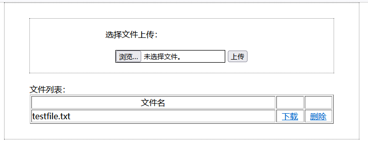
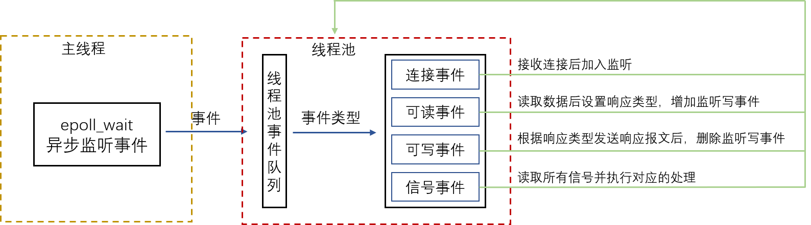
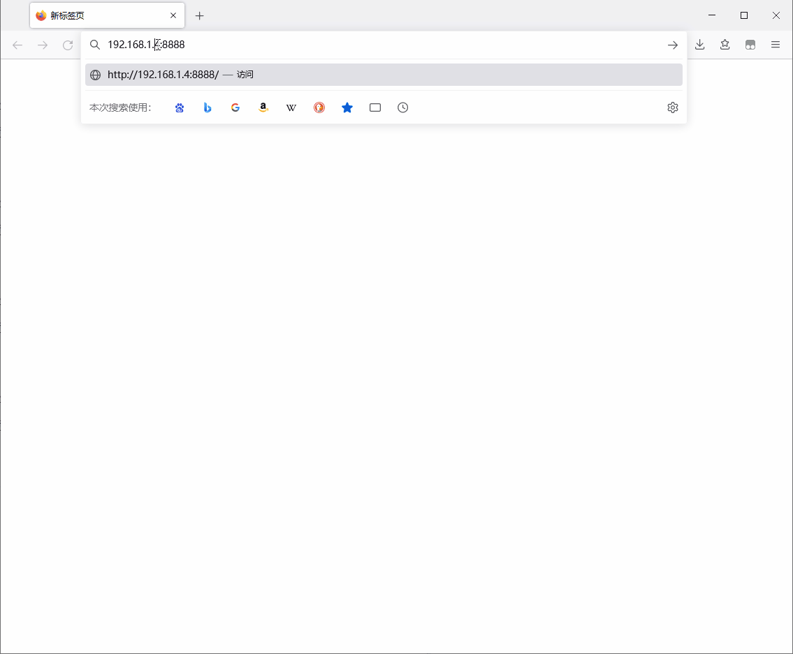
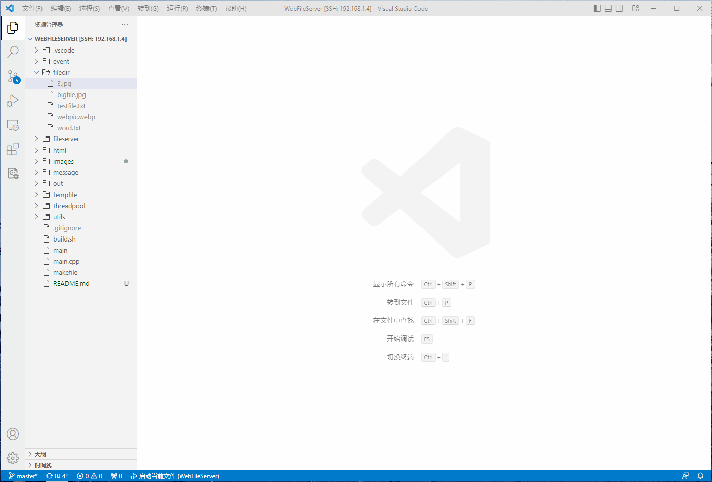

# WebFileServer

在学习完成《TCP/IP 网络编程》和《Linux高性能服务器编程》后，阅读了一些Web服务器的相关代码，自动动手使用 C++11 实现了这个 Linux 下简单 **Web 文件服务器**，通过浏览器发送 HTTP 请求管理服务器指定文件夹下的所有文件。主要功能包括：

- 以 HTML 页面形式返回该文件夹下的所有文件
- 可以选择本地文件上传到服务器
- 可以对列表中的文件文件执行下载操作
- 可以删除服务器中的指定文件

HTML 的文件列表页面如下所示：




# 整体框架

- 使用 **Reactor 事件处理模型**，通过统一事件源，主线程使用 epoll 监听所有的事件，工作线程负责执行事件的逻辑处理
- 预先创建**线程池**，当有事件发生时，加入线程池的工作队列中，使用**随机选择**算法选择线程池中的一个线程处理工作队列的事件
- 使用 HTTP **GET** 方法获取文件列表，发起下载文件、删除文件的请求。使用 **POST** 方法向服务器上传文件
- 服务端使用**有限状态机**对请求消息进行解析，根据解析结果执行操作后，向客户端发送页面、发送文件或发送重定向报文
- 服务端使用 `sendfile` 函数实现**零拷贝**数据发送




# 功能展示

## 获取文件列表



## 上传文件


## 下载文件


## 删除文件




# 运行
1. build 项目
    ```
    sh ./build.sh
    ```
2. 启动文件服务器
    ```
    ./main
    ```
3. 在浏览器端输入 `服务端ip:端口号`（端口号默认是8888）
    ```
    serverip:8888
    ```

# 拓展
由于时间匆忙，该项目仅仅完成了最基础的功能，但是该项目还有很多可以继续拓展的功能，这里简单列出，以后会继续完善：

- [ ] 现有程序中，运行日志直接输入到控制台，另设进程池实现日志服务（实现远程日志服务器）

- [ ] 增加用户注册登陆功能，根据登陆账户提供各自的文件服务

- [ ] 添加定时器定时处理非活动的连接


# 参考资料
- 《TCP/IP 网络编程》：[https://book.douban.com/subject/25911735/](https://book.douban.com/subject/25911735/)
- 《Linux高性能服务器编程》：[https://book.douban.com/subject/24722611/](https://book.douban.com/subject/24722611/)
- TinyWebServer：[https://github.com/qinguoyi/TinyWebServer](https://github.com/qinguoyi/TinyWebServer)